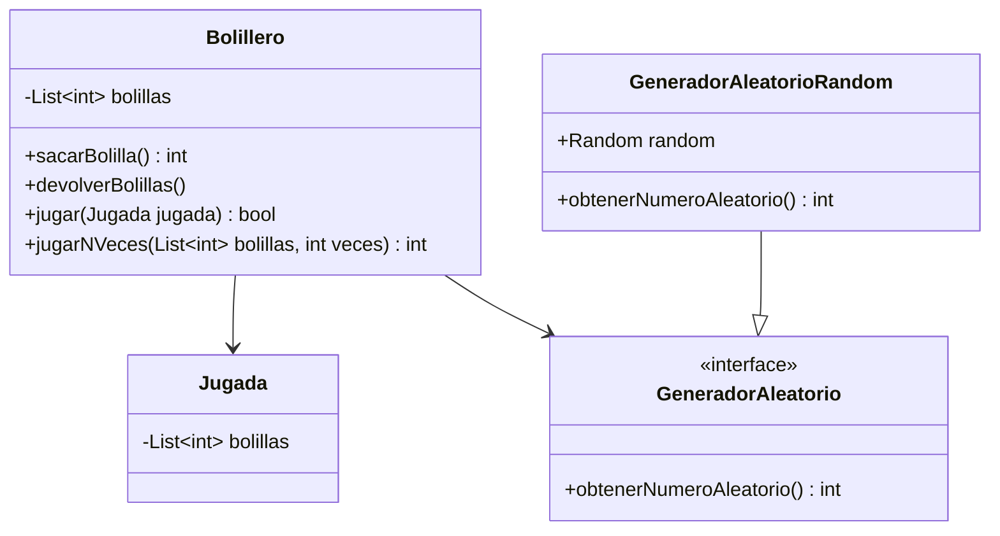

```mermaid
---
config:
theme: neo-dark
---
    classDiagram
    class Bolillero {
      -List~int~ bolillas
      +sacarBolilla() int
      +devolverBolillas()
      +jugar(Jugada jugada) bool
      +jugarNVeces(List~int~ bolillas, int veces) int
    }
    class Jugada {
      -List~int~ bolillas
    }
    class GeneradorAleatorio {
      <<interface>>
      +obtenerNumeroAleatorio() int
    }
    class GeneradorAleatorioRandom {
      +Random random
      +obtenerNumeroAleatorio() int
    }
    Bolillero --> Jugada
    Bolillero --> GeneradorAleatorio
    GeneradorAleatorioRandom --|> GeneradorAleatorio
```